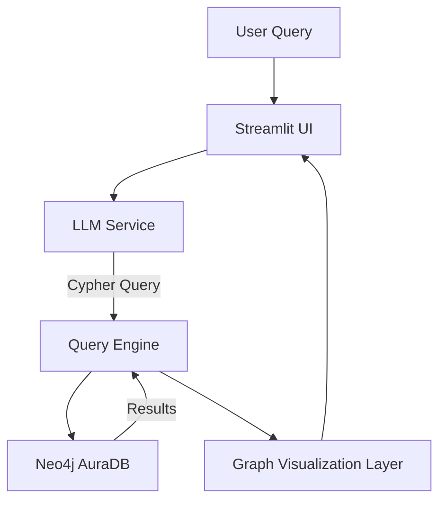

# SAP Order-to-Cash Graph Intelligence App

An AI-powered graph analytics application for exploring SAP Order-to-Cash (O2C) data using Neo4j and natural language queries.

---

## Overview

This project enables users to explore relationships between Customers, Orders, Deliveries, and Products using a graph-based approach combined with natural language querying.

The system converts user questions into Cypher queries using an LLM, executes them on a Neo4j graph database, and visualizes the results interactively.

---

## Architecture

User Query (Natural Language)  
-> LLM (Groq API) converts query to Cypher  
-> Backend executes Cypher on Neo4j  
-> Results returned and visualized  
-> Streamlit UI renders graph and chat interface  

---

## Architecture Diagram

This architecture separates UI, LLM processing, and graph querying into distinct layers, enabling modularity, scalability, and easier debugging.

---

## Key Design Decisions

- Selected a graph-based architecture as SAP O2C data is inherently relational (customer -> order -> delivery -> product), enabling efficient multi-hop traversal and relationship-centric querying.
- Designed a layered system:
  - Presentation Layer (Streamlit UI)
  - LLM Layer (natural language to Cypher conversion)
  - Query Layer (backend execution engine)
  - Data Layer (Neo4j graph database)
- LLM is used strictly for query generation, ensuring deterministic data retrieval from the database.

---

## Database Choice

### Why Neo4j?

- SAP O2C data naturally forms a graph:
  - Customers place Orders
  - Orders generate Deliveries
  - Deliveries include Products
- Neo4j enables:
  - Efficient relationship traversal
  - Flexible schema for evolving enterprise data
  - Expressive querying using Cypher

### Cloud Deployment

- Initially developed using local Neo4j
- Migrated to Neo4j AuraDB (cloud) for production deployment
- Enabled secure external access from Streamlit Cloud

---

## LLM Prompting Strategy

The LLM is used to convert natural language into Cypher queries.

### Approach

- Structured prompts instruct the model to:
  - Generate only Cypher queries
  - Use predefined schema entities (Customer, Order, Delivery, Product)
  - Follow valid relationship patterns

### Example Prompt Pattern

"Convert the following question into a Cypher query using the SAP O2C schema. Only return the query."

### Design Considerations

- Avoid free-form responses from the LLM
- Enforce query-only outputs for reliability
- Keep prompts deterministic to reduce hallucination risk

---

## Guardrails

To ensure safety and correctness:

### 1. Query Restriction
- Only SAP dataset-related queries are allowed
- Prevents irrelevant or unsafe operations

### 2. Controlled LLM Output
- LLM is constrained to generate Cypher queries only
- No execution of arbitrary code or instructions

### 3. Secure Secret Management
- API keys stored in `.env` (local)
- Managed via Streamlit Secrets in deployment
- Never committed to version control

### 4. Deployment Safety
- Removed all hardcoded credentials
- Resolved GitHub push protection violations
- Ensured secure cloud configuration

---

## Tech Stack

- Frontend: Streamlit  
- Backend: Python  
- Database: Neo4j AuraDB  
- LLM: Groq API  
- Visualization: PyVis  

---

## Features

- Natural language querying of graph data
- Real-time Cypher execution
- Interactive graph visualization
- Cloud deployment support

---

## Live Demo

https://sap-o2c-graph-janxfv3sxqukse7mvzngob.streamlit.app

---

## Project Structure

sap-o2c-graph/  
│  
├── app.py  
├── backend.py  
├── ui.py  
├── load_sap_o2c_to_neo4j.py  
├── requirements.txt  
└── README.md  

---

## Setup (Local)

### 1. Clone repository

git clone https://github.com/SURYAS1306/sap-o2c-graph.git  
cd sap-o2c-graph  

### 2. Install dependencies

pip install -r requirements.txt  

### 3. Configure environment variables

Create a `.env` file:

GROQ_API_KEY=your_key  
NEO4J_URI=your_uri  
NEO4J_USER=neo4j  
NEO4J_PASSWORD=your_password  

### 4. Run the application

streamlit run ui.py  

---

## Key Highlights

- End-to-end AI and graph-based system
- Fully deployed cloud application (Streamlit + Neo4j AuraDB)
- Real-time natural language querying over graph data
- Modular and scalable architecture

---

## Future Improvements

- Path highlighting between entities
- Advanced graph filtering
- Multi-hop reasoning using LLM
- Enhanced UI interactions

---

## Author

Surya Srinivasan  
B.Tech Computer Science Engineering  
VIT Vellore
